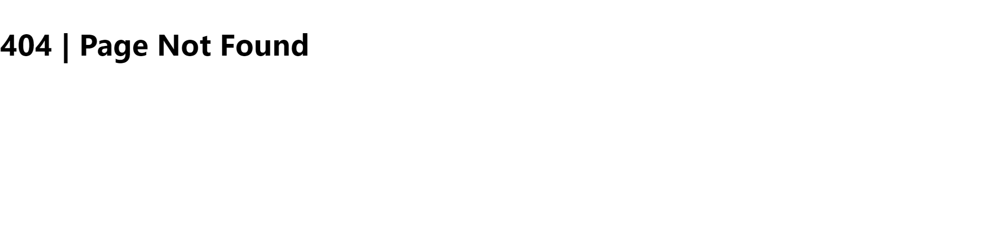

# はじめに
Next.jsのエラーページの設定について少しはまったのでメモしておきます。

Next.jsの[公式チュートリアル](https://nextjs.org/learn/basics/create-nextjs-app)を1周した後にやると効率的です。

# 環境
WSL2

# next/errorについて
[next/error](https://nextjs.org/docs/advanced-features/custom-error-page)を読んでみる。

今回はTypeScriptを用いるので読み替え/書き換えている。

設定を行うと`pages/_error.tsx`に入ってきたステータスコードに応じてページが表示される。
しかし、`pages/404.tsx`と`pages/500.tsx`を用意しておくと`pages/_error.tsx`に入ってきたステータスコードのうち`404`と`500`だけをそれぞれのカスタムページ`pages/404.tsx`、`pages/500.tsx`にリダイレクトしてくれる。


# 動作確認
順番に設定を変更していき、無効なURLをリクエストした際にどのようなページが表示されるかを確認してみる。
```
Request URL: http://localhost:3000/aaa
Request Method: GET
Status Code: 404 Not Found
```

## 1. 初期設定では無機質なページが表示される
- 画面


## 2. `pages/_error.tsx`を追加するとErrorコンポーネント内のソースに応じたページが表示される
- ソース
```tsx: pages/_error.tsx
import React from 'react';
import { NextPage, NextPageContext } from 'next';
interface Props {
    statusCode: number;
}
const Error: NextPage<Props> = ({ statusCode }) => {
  return <div>{statusCode}エラーが発生しました</div>;
};

Error.getInitialProps = async ({ res, err }: NextPageContext) => {
  const statusCode = res ? res.statusCode : err ? err.statusCode ?? 500 : 404;
  return { statusCode };
};

export default Error;
```
- 画面


- コメント

このソースが反映されている。
```
<div>{statusCode}エラーが発生しました</div>
```


## 3. `pages/404.tsx`, `pages/500.tsx`を追加するとカスタムページが表示される
- ソース
```tsx: pages/_404.tsx
export default function Custom404() {
    return <h1>404 | Page Not Found</h1>
  }
```

```tsx: pages/_500.tsx
export default function Custom500() {
    return <h1>500 | Server-side error occurred</h1>
  }
```

- 画面



- コメント

`pages/_error.tsx`内のこのソースが反映されず、カスタムページに上書きされている。
```
<div>{statusCode}エラーが発生しました</div>
```


# おまけ
ユーザが無効なリクエストをしたときに無機質な404ページが表示されると次の手段に移行できないため、大規模ユーザを抱えるサイトではカスタムエラーページを用意することが一般的になっています。カスタムページにはそのwebサイトのヘッダーとフッター、何が起こったのかという文言、次のアクションを指定する「TOPページに戻る」などのボタンが用意されています。こういったカスタムページを用意するちょっとした気遣いでユーザ離れを回避することができそうですね。最後までお読みいただきありがとうございました。